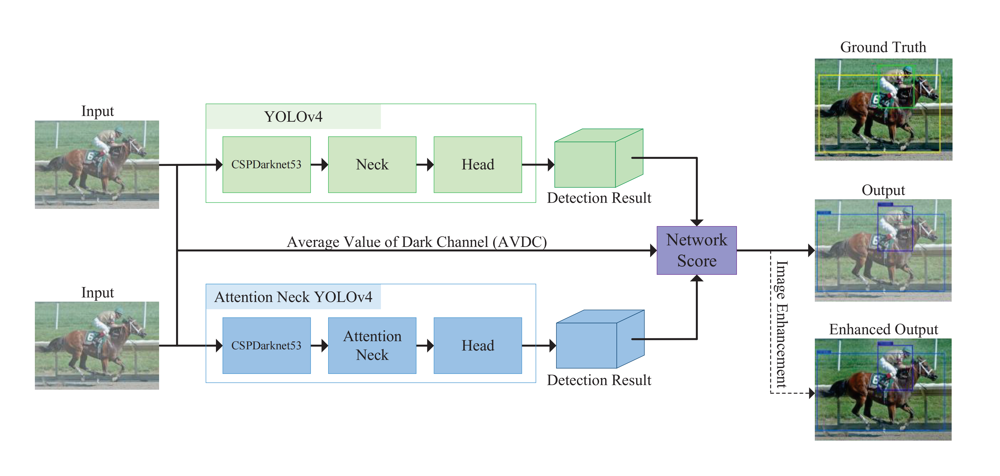

# ISA-Ingenious-Siamese-Attention-for-Object-Detection-Algorithms-towards-Complex-Scenes

This is the official repository for paper "ISA: Ingenious Siamese Attention for Object Detection Algorithms towards Complex Scenes".

---

Our paper has been accepted by ***ISA Transactions***.

Link: https://www.sciencedirect.com/science/article/abs/pii/S0019057823004007

A Chinese translation of our paper has been published on ***Zhihu***.

Link: https://zhuanlan.zhihu.com/p/659753274


---

## Introduction

The interference of complex environments on object detection tasks dramatically limits the application of object detection algorithms. Improving the detection accuracy of the object detection algorithms is able to effectively enhance the stability and reliability of the object detection algorithm-based tasks in complex environments. In order to ameliorate the detection accuracy of object detection algorithms under various complex environment transformations, this work proposes the Siamese Attention YOLO (SAYOLO) object detection algorithm based on ingenious siamese attention structure. The ingenious siamese attention structure includes three aspects: Attention Neck YOLOv4 (ANYOLOv4), siamese neural network structure and special designed network scoring module. In the Complex Mini VOC dataset, the detection accuracy of SAYOLO algorithm is 12.31%, 48.93%, 17.80%, 10.12%, 18.79% and 1.12% higher than Faster-RCNN (Resnet50), SSD (Mobilenetv2), YOLOv3, YOLOv4, YOLOv5-l and YOLOX-x, respectively. Compared with traditional object detection algorithms based on image preprocessing, the detection accuracy of SAYOLO is 4.88%, 11.51%, 1.73%, 23.27%, 18.12%, and 5.76% higher than Image-Adaptive YOLO, MSBDN-DFF + YOLOv4, Dark Channel Prior + YOLOv4, Zero-DCE + YOLOv4, MSBDN-DFF + Zero-DCE + YOLOv4, and Dark Channel Prior + Zero-DCE + YOLOv4, respectively.

### Overall Network Structure



### Attention Neck YOLOv4 (ANYOLOv4)


### Special Designed Network Scoring Module


### Detection Results Under Real Limit Conditions


## Usage

### Environment Install

```python
pip install -r requirements.txt
```

### Weights

Download the SAYOLO Network Weights and place them (file: best_epoch_weights.pth; file: CSPdarknet53_backbone_weights.pth; file: yolo4_voc_weights.pth) in the "model_data" folder.

**SAYOLO Network Weights**:

Link: https://pan.baidu.com/s/1xu-TkFKaDyfVU6-sars9vQ?pwd=Lisa

### Detection

First, you should select the weights both for the YOLOv4 and ANYOLOv4 subnetwork in file 'yolo.py'.

```python
# "model_path" is the weight path of the YOLOv4 subnetwork.
"model_path": 'model_data/yolo4_voc_weights.pth'
# "model_path" is the weight path of the ANYOLOv4 subnetwork.
"model_path_attention": 'model_data/best_epoch_weights.pth'
```

Then you can detect the images through the following command.

```python
python predict.py
```

### Dataset

Download the Complex Mini VOC Dataset and place them (folder: VOCdevkit; file: 2007_train.txt; file: 2007_val.txt) in the "ISA-Ingenious-Siamese-Attention-for-Object-Detection-Algorithms-towards-Complex-Scenes" folder.

#### **Complex Mini VOC Dataset**:

Link: https://pan.baidu.com/s/1sxbn3gvr0pdES-dURVro6g?pwd=Lisa

#### **Private Dataset**:

**File Structure:**

#--VOCdevkit
|	#--VOC2007
|	|	#--Annotations
|	|	|	#--000001.xml
|	|	|	#--000002.xml
|	|	|	#--000003.xml
|	|	|	...
|	|	#--ImageSets
|	|	|	#--Main
|	|	|	|	#--test.txt
|	|	|	|	#--train.txt
|	|	|	|	#--trainval.txt
|	|	|	|	#--val.txt
|	|	#--JPEGImages
|	|	|	#--000001.jpg
|	|	|	#--000002.jpg
|	|	|	#--000003.jpg
|	|	|	...

After making the dataset, place them (folder: VOCdevkit) in the "ISA-Ingenious-Siamese-Attention-for-Object-Detection-Algorithms-towards-Complex-Scenes" folder.

**Modify Detection Objects:**

Modify tetection objects in 'voc_classes.txt' (in folder 'model_data').

**Generate ‘xxx.txt’ Files:**

```python
python voc_annotation.py
```

### Train

Select the subnetwork branch (YOLOv4 or ANYOLOv4) to train in the file 'train.py'：

```python
# YOLOv4 Branch
YOLOv4_Branch   = 'YOLOv4'
# ANYOLOv4 Branch
YOLOv4_Branch   = 'ANYOLOv4'
```

Modify the pre-training weight path in the file 'train.py'：

```python
# Cause you are training a new network, there is no appropriate weight for it, so the weight is none. Therefore, the value of parameter 'model_path' is ''.
model_path      = ''
```

Now you can train the subnetwork through the following command.

```python
python train.py
```

## Paper Content Correction

- The "CBAB" in the third row and fifth column of Table 5 should be "CBAM".
- On page 8, the formulas (10), (11) and (12) cited in the text should be (13), (14) and (15), respectively.

## Acknowledgement

This work was supported by the National Natural Science Foundation of China (No. 62003296), the Natural Science Foundation of Hebei (No. F2020203031), the Science and Technology Project of Hebei Education Department (No. QN2020225), the National Undergraduate Training Program for Innovation and Entrepreneurship of China (No. 202210216001).

## Citation

```latex
@article{LIU2023,
title = {ISA: Ingenious Siamese Attention for object detection algorithms towards complex scenes},
journal = {ISA Transactions},
year = {2023},
issn = {0019-0578},
doi = {https://doi.org/10.1016/j.isatra.2023.09.001},
url = {https://www.sciencedirect.com/science/article/pii/S0019057823004007},
author = {Lianjun Liu and Ziyu Hu and Yan Dai and Xuemin Ma and Pengwei Deng},
keywords = {Complex scenes, Object detection, Siamese network, YOLO}
}
```

## Reference

https://github.com/bubbliiiing/yolov4-pytorch
